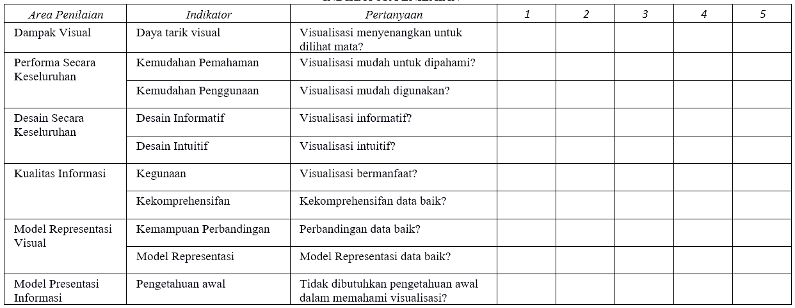
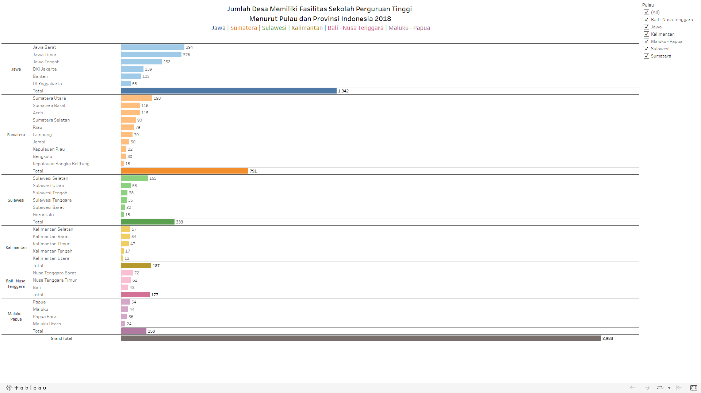
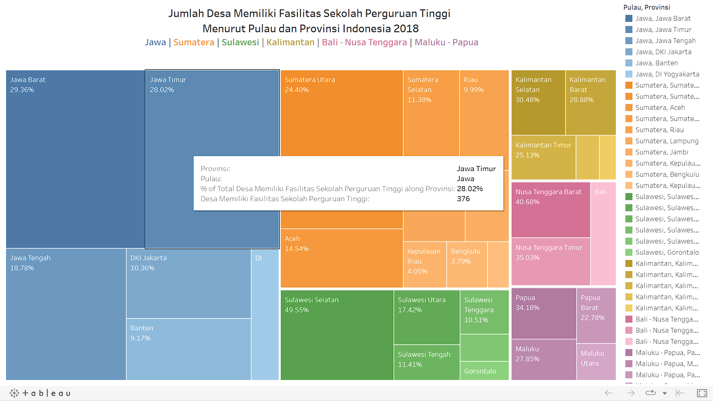
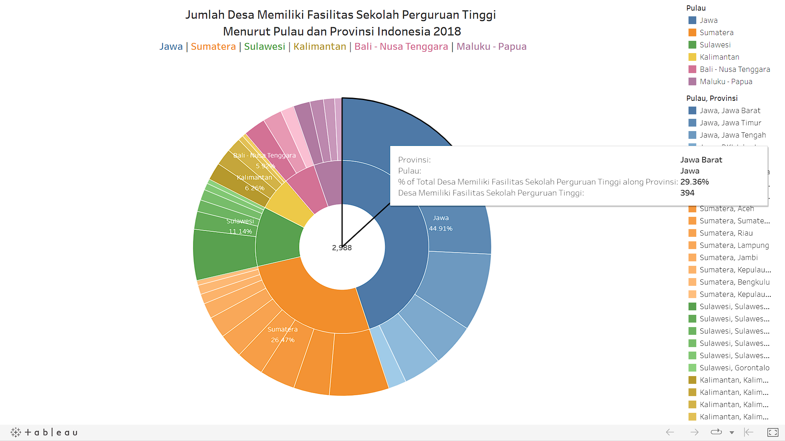
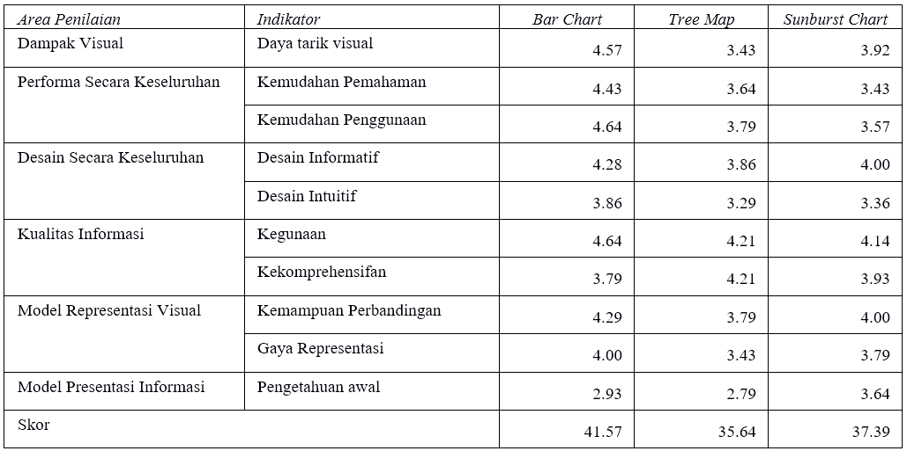

# Proyek Implementasi dan Evaluasi Visualisasi Data Berhirarki Publikasi Statistik Potensi Desa 2018

<!-- ABOUT THE PROJECT -->
## Tentang Proyek
### Proyek ini bertujuan untuk:  
- Mengimplementasikan teknik visualisasi data berhirarki pada data Potensi Desa 2018 dengan tiga teknik visualisasi data berhirarki yaitu Bar Chart, Tree Map, dan Sunburst Chart
- Melakukan evaluasi visualisasasi data berhirarki dan mengetahui peringkat visualisasi data berhirarki terbaik pada data Potensi Desa 2018.
 

### Data yang digunakan:
Podes 2018: Jumlah Desa/Kelurahan Yang Mempunyai 
Sekolah Akademi/Perguruan Tinggi, tingkat pulau dan provinsi.
 
 

### Metode Analisis:
Analisis deskriptif menganalisis evaluasi reponden terhadap implementasi visualisasi data berhirarki menggunakan Bar Chart, Tree Map, dan Sunburst Chart berdasarkan 10 indikator sebagai berikut:
 

 

## Hasil Implementasi

### Bar Chart

link: https://public.tableau.com/app/profile/wildannissa.pinasti/viz/VisualisasiData1-Barchart/BarChart.

Visualisasi Bar Chart ini tidak hanya menampilkan data, tetapi juga terdapat fitur interaktif untuk memilih tampilan berdasarkan ‘Pulau’ dan dapat menampilkan detail pada bagian yang diinginkan.
 
 

### Tree Map

Link: https://public.tableau.com/app/profile/wildannissa.pinasti/viz/VisualisasiData2-Treemap/TreeMap

Visualisasi tree map ini tidak hanya menampilkan data, tetapi juga terdapat fitur interaktif untuk memilih tampilan berdasarkan ‘Pulau, Provinsi’ dan dapat menampilkan detail pada bagian yang diinginkan.
 
 

### Sunburst Chart

Link: https://public.tableau.com/app/profile/wildannissa.pinasti/viz/VisualisasiData3-SunburstChart/SunBurst

Visualisasi Sunburst Chart ini tidak hanya menampilkan data, tetapi juga terdapat fitur interaktif untuk memilih tampilan berdasarkan ‘Pulau’ atau ‘Pulau, Provinsi’ dan dapat menampilkan detail pada bagian yang diinginkan.
 
 

(<a href="#top">back to top</a>)

## Hasil Evaluasi

Dapat disimpulkan bahwa urutan visualisasi data berhirarki terbaik secara berturut-turut yaitu Bar Chart, Sunburst Chart dan Tree Map.
 
 

(<a href="#top">back to top</a>)

